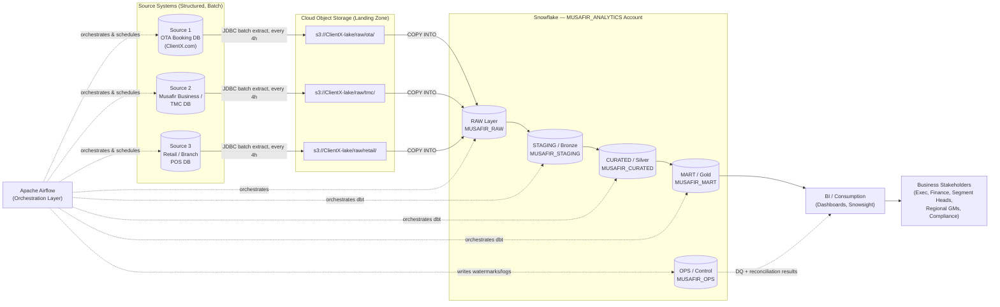
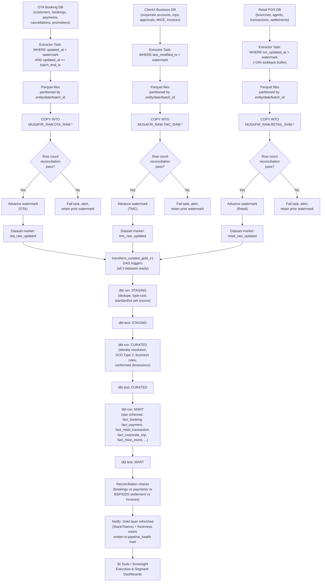
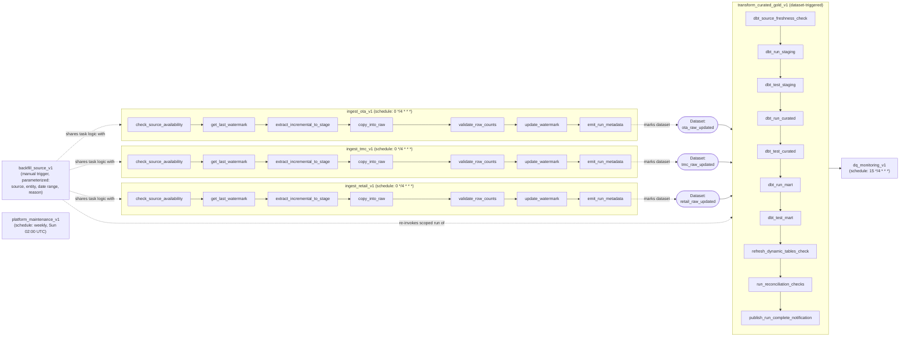
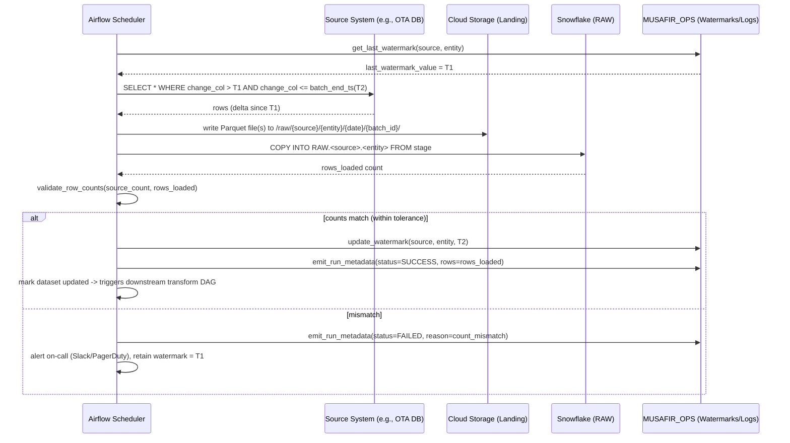
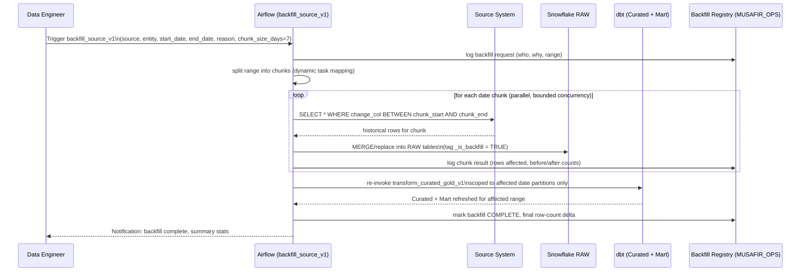
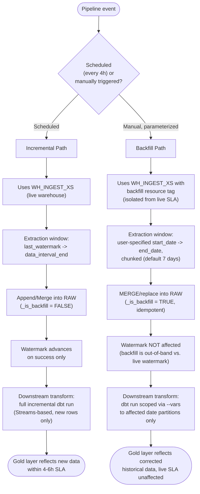
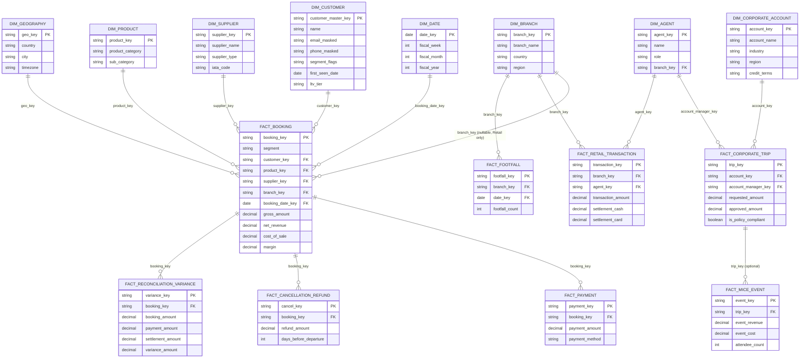
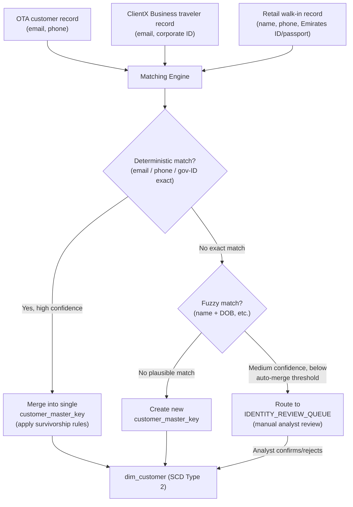

# ClientX.com — Analytics Enablement Program
## Detailed ETL / Dataflow Architecture (Diagrams)

| | |
|---|---|
| **Program Name** | ClientX Unified Analytics Platform (MUAP) |
| **Document Type** | Dataflow & ETL Architecture Diagrams |
| **Version** | 1.0 |
| **Date** | 2025-07-22 |
| **Companion Document** | `01_Business_and_Core_Document.md`, `02_Technical_Architecture_Document.md` |

> All diagrams are authored in **Mermaid** syntax. They render natively in VS Code (Mermaid preview extension), GitHub/GitLab markdown, Obsidian, and any Mermaid-compatible viewer. This document is the visual companion to the Technical Architecture Document (`02_...`) — every diagram here corresponds to a section number there.

---

## 1. System Context Diagram (Who Talks to What)



---

## 2. End-to-End Detailed Dataflow (Medallion Architecture)



---

## 3. Airflow DAG Dependency Graph (Orchestration View)



---

## 4. Incremental Load — Sequence Diagram



---

## 5. Backfill Flow — Sequence Diagram



---

## 6. Incremental vs. Backfill — Decision & Isolation Logic



---

## 7. Data Model — Conformed Star Schema (Entity Relationship Diagram)



---

## 8. Identity Resolution (Customer 360) Flow



---

## 9. Security Enforcement Flow (Query-Time)

```mermaid
flowchart LR
    U["User / BI Tool\n(e.g., Retail Analyst, Qatar region)"] -->|Query MUSAFIR_MART| RBAC{"Role has\nGRANT on schema/object?"}
    RBAC -->|No| DENY["Access Denied"]
    RBAC -->|Yes| ROW{"Row Access Policy\nevaluates branch_region\nagainst role's allowed region"}
    ROW -->|Fails| EMPTY["Rows filtered out\n(no error, zero rows for\nout-of-scope region)"]
    ROW -->|Passes| MASK{"Dynamic Masking Policy\non PII columns"}
    MASK -->|Role lacks PII grant| MASKED["Returns masked values\n(e.g., j***@domain.com)"]
    MASK -->|Role has PII grant\n(Finance/Compliance)| CLEAR["Returns unmasked values\n(fully audited via ACCESS_HISTORY)"]
```

---

## 10. Batch Schedule Timeline (Business Day View)

```mermaid
gantt
    title 4-Hour Batch Cycle (UTC) — Illustrative Single Day
    dateFormat  HH:mm
    axisFormat  %H:%M
    section Ingestion (Sources -> RAW)
    ingest_ota_v1        :done, i1, 00:00, 20m
    ingest_tmc_v1        :done, i2, 00:00, 15m
    ingest_retail_v1     :done, i3, 00:00, 10m
    section Transformation (RAW -> Gold)
    transform_curated_gold_v1 :active, t1, 00:20, 30m
    dq_monitoring_v1          :t2, 00:50, 15m
    section Next Cycle
    ingest_ota_v1_next   :i4, 04:00, 20m
    ingest_tmc_v1_next   :i5, 04:00, 15m
    ingest_retail_v1_next:i6, 04:00, 10m
```



*(Cycle repeats at 04:00, 08:00, 12:00, 16:00, 20:00 UTC — 6 cycles/day, meeting the 4–6 hour freshness SLA defined in Business Doc §6.)*

---

## 11. Diagram-to-Document Cross-Reference

| Diagram | Corresponding Technical Doc Section | Corresponding Business Doc Section |
|---|---|---|
| §1 System Context | §3 High-Level Architecture | §5 Data Sources |
| §2 Detailed Dataflow | §5 Snowflake Platform Design | §6 Ingestion & Refresh Cadence |
| §3 DAG Dependency Graph | §6.3–§6.5 Orchestration | §6 Ingestion & Refresh Cadence |
| §4 Incremental Sequence | §6.6 Incremental Load Logic | §6 Ingestion & Refresh Cadence |
| §5 Backfill Sequence | §6.7 Backfill Design | §6 Ingestion & Refresh Cadence, §9.3 Risk |
| §6 Incremental vs Backfill | §6.6–§6.7 | §6 |
| §7 Star Schema ERD | §8 Data Model | §7 Business Use Cases |
| §8 Identity Resolution | §5.4.1 Customer 360 Engine | §5.4 Cross-Source Business Keys |
| §9 Security Enforcement | §9 Security & Access Control | §9 Governance, Compliance & Risk |
| §10 Batch Timeline | §6.8 Scheduling Summary | §6 Ingestion & Refresh Cadence |

---

*End of ETL Dataflow Architecture Document. This is the third and final document of the ClientX Unified Analytics Platform documentation set, alongside `01_Business_and_Core_Document.md` and `02_Technical_Architecture_Document.md`.*
